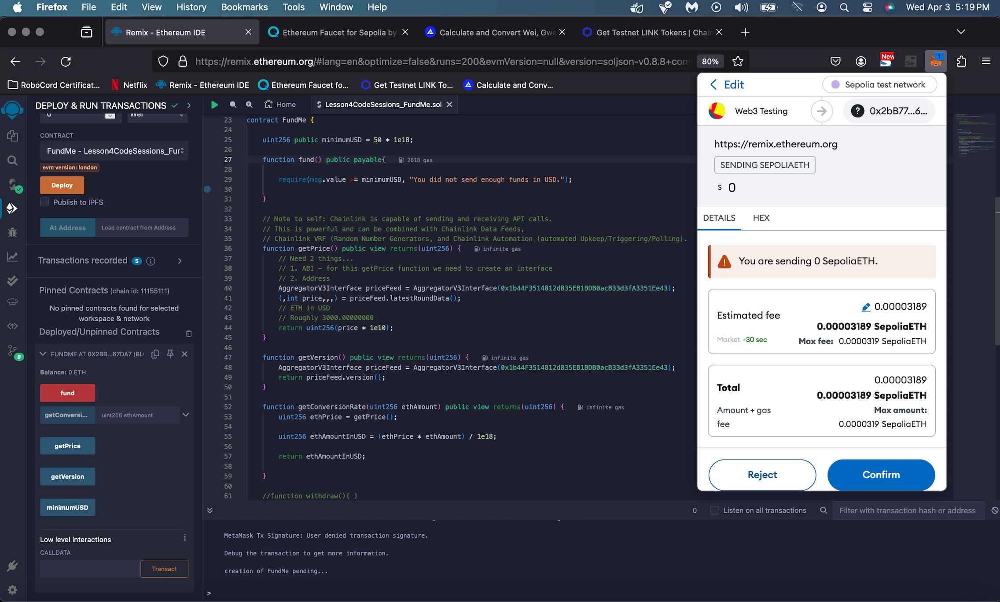
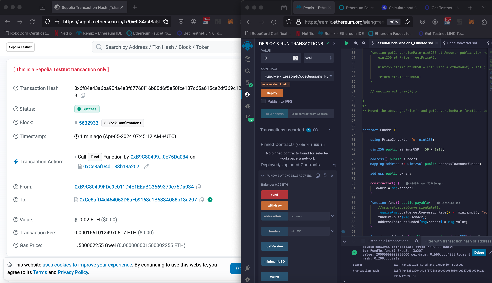

These are my notes while working on [Patrick's Javascript Blockchain/Smart Contract FreeCodeCamp Course](https://www.youtube.com/watch?v=gyMwXuJrbJQ).

- On April 3, 2024 successfully compiled and deployed the following "fund and getPrice etc." example code. 
  - **Note to self:** For today I stopped at [4:25 in Patrick's YouTube course video](https://youtu.be/gyMwXuJrbJQ?t=15902).

- On April 5, 2024 successfully compiled and deployed the following final version of my Lesson4CodeSessions_FundMe.sol example code that uses the PriceConverter.sol library. 

This deployed contract sent funds to the following address on Sepolia Testnet.
https://sepolia.etherscan.io/tx/0x6f84e43a6ba904a4e3f67768f16b00d6f5e50fce187c65a615ce2df369c12559
